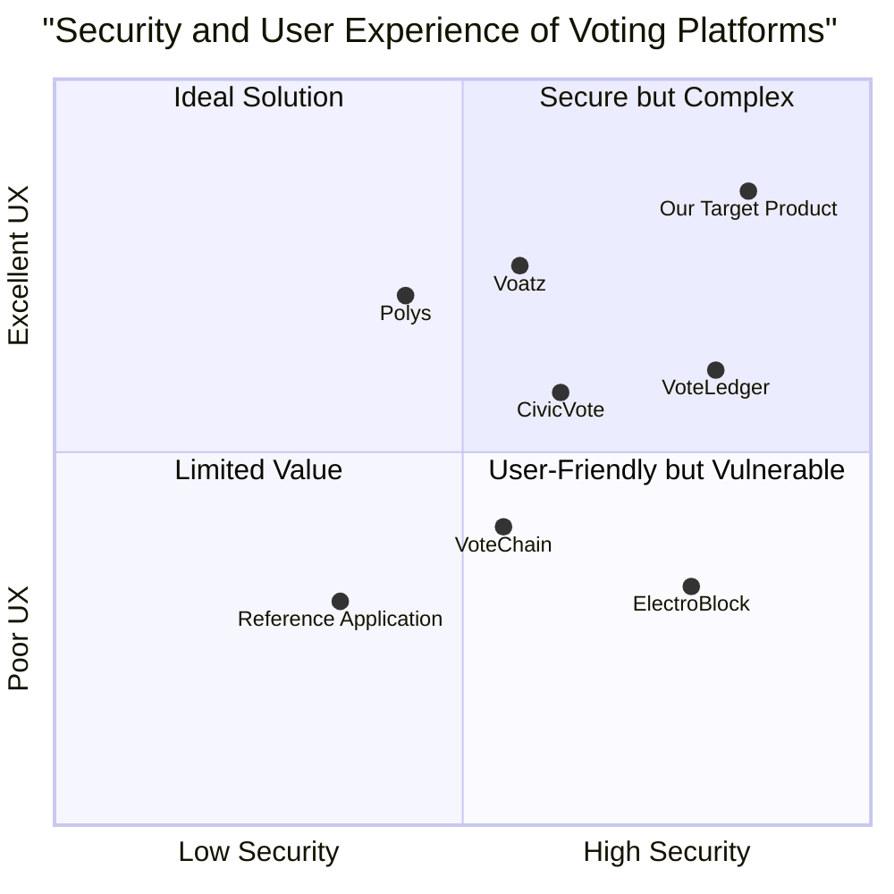

# Product Requirements Document (PRD)
# Modernized Decentralized Voting System

**Last Updated:** 2025-05-23
**Project Name:** secure_vote_chain

## Original Requirements

Create a modernized decentralized voting system based on the reference application with the following enhancements:
1. Real-time vote count visibility during voting
2. Voter ID linked to wallet addresses to prevent double voting
3. Login verification of voter ID before wallet connection
4. Role-based access control (Electoral Commission vs Voters)
5. Only Electoral Commission can register voters and candidates
6. Voters should only see login, voting interface and real-time results
7. Built using either Hardhat or Thirdweb with React
8. Modern and user-friendly interface

## 1. Product Definition

### 1.1 Product Goals

1. **Security & Integrity**: Create a tamper-proof voting system that ensures one-person-one-vote while maintaining auditability and transparency
2. **Accessibility & Usability**: Deliver an intuitive user experience that requires minimal technical knowledge for voters while providing powerful management tools for electoral officials
3. **Scalability & Performance**: Build a robust system capable of handling large-scale elections with real-time result tracking without performance degradation

### 1.2 User Stories

1. **As an electoral commission official**, I want to register eligible voters and candidates securely, so that only authorized participants can take part in the election
2. **As an electoral commission official**, I want an administrative dashboard to monitor election progress, so that I can ensure the election is running smoothly
3. **As a voter**, I want to securely authenticate with my voter ID and connect my wallet, so that I can participate in the election while ensuring my vote is properly counted
4. **As a voter**, I want to see real-time voting results, so that I can stay informed about the current status of the election
5. **As a voter**, I want a simple and intuitive interface, so that I can cast my vote easily without technical confusion

### 1.3 Competitive Analysis

| Product | Pros | Cons |
|---------|------|------|
| **VoteChain** | • Secure blockchain implementation • Basic user interface • Transparent vote counting | • Limited admin controls • No real-time updates • Minimal security for voter verification |
| **ElectroBlock** | • Multi-chain support • Strong encryption • Good documentation | • Complex setup process • High gas costs • Poor mobile experience |
| **CivicVote** | • Identity verification system • Good administrative tools • Audit capabilities | • Centralized components • Limited customization • No real-time results |
| **VoteLedger** | • High throughput capacity • Strong security features • Professional UI | • Expensive implementation • Complex for ordinary voters • Limited blockchain options |
| **Polys** | • User-friendly interface • Decent security protocols • Mobile support | • Semi-centralized architecture • Limited admin controls • Delayed result reporting |
| **Voatz** | • Biometric verification • Strong mobile experience • Multiple voting options | • Proprietary codebase • Security concerns • Limited transparency |
| **Reference Application** | • Basic blockchain integration • Functional voting capability • Open-source | • Outdated interface • Limited security features • No role-based access control |

### 1.4 Competitive Quadrant Chart

## 2. Technical Specifications

### 2.1 Requirements Analysis

The modernized decentralized voting system requires a robust blockchain implementation with advanced security features, real-time data synchronization, and a dual-interface design that separates voter and administrator experiences. The system must maintain the integrity of the democratic process through secure identity verification while providing transparent and accessible voting mechanisms.

The solution must be built on Ethereum using either Hardhat or Thirdweb development frameworks with a React frontend to ensure a responsive and intuitive user interface. Smart contracts will handle critical voting logic, user authentication, and vote tallying while the frontend will provide differentiated experiences based on user roles.

Real-time result tracking requires efficient data indexing and event listening capabilities, while the integration of wallet connections with voter IDs demands a secure verification protocol to prevent fraud while maintaining voter privacy.

### 2.2 Requirements Pool

#### P0 (Must-Have)

1. **Voter Authentication System**
   - Must implement secure voter ID verification before wallet connection
   - Must link verified voter IDs to unique wallet addresses to prevent double voting
   - Must maintain a secure registry of eligible voters

2. **Role-Based Access Control**
   - Must provide separate interfaces for voters and electoral commission officials
   - Must restrict administrative functions to authorized electoral commission accounts
   - Must prevent unauthorized access to management features

3. **Smart Contract Infrastructure**
   - Must implement secure voting smart contracts on Ethereum
   - Must include functions for voter registration, candidate registration, vote casting, and vote counting
   - Must ensure vote integrity and prevent manipulation

4. **Real-Time Results**
   - Must display live vote counts as votes are cast
   - Must update automatically without requiring page refresh
   - Must present results in easily understandable visual formats

5. **Voter Experience**
   - Must provide a streamlined login process
   - Must offer an intuitive voting interface
   - Must display all candidates with relevant information
   - Must confirm successful vote submission

#### P1 (Should-Have)

6. **Administrative Dashboard**
   - Should provide comprehensive election management tools
   - Should display detailed analytics on voting patterns and turnout
   - Should allow configuration of election parameters (start time, end time, etc.)

7. **Responsive Design**
   - Should function correctly on mobile, tablet, and desktop devices
   - Should adapt layouts to different screen sizes
   - Should maintain usability across various devices

8. **Error Handling**
   - Should provide clear feedback for transaction failures
   - Should guide users through connection issues
   - Should offer recovery paths for interrupted sessions

9. **Performance Optimization**
   - Should minimize gas costs for blockchain interactions
   - Should implement efficient data loading strategies
   - Should handle concurrent users without degradation

#### P2 (Nice-to-Have)

10. **Advanced Analytics**
    - May include demographic analysis tools (while maintaining voter privacy)
    - May provide historical comparison with previous elections
    - May offer projection capabilities based on current trends

11. **Multiple Election Support**
    - May allow running several elections simultaneously
    - May provide templates for different election types
    - May include archiving of past elections

12. **Customizable UI**
    - May allow branding customization for different organizations
    - May offer theme selection
    - May support internationalization

13. **Audit Tools**
    - May include advanced verification mechanisms
    - May provide downloadable audit records
    - May support third-party verification

### 2.3 UI Design Draft

#### Voter Interface

1. **Login Screen**
   - Clean, minimalist design with clear instructions
   - Voter ID input field with validation
   - "Connect Wallet" button (disabled until valid voter ID entered)
   - System status indicators
   - Help/Support access

2. **Voting Interface**
   - Header with election title and user information
   - Candidate cards with photos, names, and brief descriptions
   - Clear voting buttons with confirmation dialogs
   - Progress indicator showing completion status
   - Option to view current results

3. **Results Dashboard**
   - Real-time vote tally visualization (bar/pie charts)
   - Percentage and raw vote counts
   - Total voter turnout statistics
   - Time-based voting activity graph
   - Share buttons for social media

#### Electoral Commission Interface

1. **Admin Dashboard**
   - Authentication with wallet and additional security
   - Overview statistics and alerts
   - Election status controls (setup, start, pause, end)
   - Navigation to management sections

2. **Voter Management**
   - Add individual voters or bulk import
   - Search and filter capabilities
   - Edit/remove functionality
   - Verification status monitoring

3. **Candidate Management**
   - Add candidate with details and platform
   - Upload candidate images
   - Order and categorize candidates
   - Preview candidate display

4. **Election Monitoring**
   - Real-time voting activity monitor
   - Security alert system
   - Performance metrics
   - Advanced analytics tools

### 2.4 Open Questions

1. **Scalability Considerations**
   - How many concurrent voters must the system support?
   - Should the system implement Layer 2 scaling solutions?
   - What are the expected peak load periods?

2. **Identity Verification**
   - What level of identity verification is required beyond voter ID?
   - Should the system integrate with existing government ID systems?
   - How will voter privacy be maintained while ensuring verification?

3. **Recovery Mechanisms**
   - What happens if a voter loses access to their wallet?
   - Should there be provisions for vote changes within a time window?
   - How will system failures be handled without compromising vote integrity?

4. **Deployment Strategy**
   - Which Ethereum network will be used (mainnet, testnet, or private network)?
   - Will gas fees be subsidized for voters?
   - What is the expected timeline for testing and deployment phases?

5. **Regulatory Compliance**
   - What legal requirements must the system satisfy?
   - How will data retention policies be implemented?
   - Are there accessibility standards that must be met?

## 3. Implementation Strategy

### 3.1 Technical Stack Selection

Based on the requirements and comparative analysis, the recommended technical stack is:

1. **Blockchain Development Framework**: Thirdweb
   - Rationale: Thirdweb offers pre-built components for faster development, better frontend integration capabilities, and simplified wallet connections that will accelerate development while maintaining security for standard voting mechanisms.

2. **Smart Contract Environment**: Solidity with OpenZeppelin security libraries
   - Rationale: Industry-standard security practices with widely-audited components

3. **Frontend Framework**: React with Tailwind CSS
   - Rationale: Fast development, responsive design capabilities, and modern UI components

4. **State Management**: Redux for global state, React Context for component state
   - Rationale: Efficient state management for real-time data updates

5. **Testing Framework**: Hardhat testing suite with Chai assertions
   - Rationale: Comprehensive testing capabilities for critical voting logic

### 3.2 Development Phases

1. **Phase 1: Core Smart Contract Development**
   - Develop and test core voting contracts
   - Implement role-based access control
   - Set up voter authentication system

2. **Phase 2: Frontend User Interfaces**
   - Develop voter experience screens
   - Create administrative dashboard
   - Implement responsive design

3. **Phase 3: Integration and Real-Time Features**
   - Connect frontend to smart contracts
   - Implement wallet connection flows
   - Build real-time result tracking system

4. **Phase 4: Testing and Security Audit**
   - Comprehensive smart contract auditing
   - User testing for both voter and admin interfaces
   - Performance optimization and stress testing

5. **Phase 5: Deployment and Documentation**
   - Mainnet deployment procedures
   - Administrator training materials
   - User documentation and help resources

## 4. Success Criteria

### 4.1 Technical Metrics

- Smart contract security audit passes with no critical or high-severity issues
- System handles 1000+ concurrent voters without performance degradation
- Transaction costs optimized to under 0.001 ETH per vote
- Page load time under 2 seconds on standard connections
- 99.9% uptime during active election periods

### 4.2 User Experience Metrics

- Average time to complete voting process under 3 minutes for first-time users
- Task success rate of ≥95% for voter registration and voting
- System Usability Scale (SUS) score of 80 or higher
- Less than 5% of users requiring support assistance
- Positive sentiment in post-voting feedback (≥85%)

### 4.3 Business Metrics

- Increased voter participation compared to traditional methods
- Reduced operational costs for election management
- Faster result tabulation (immediate vs. hours/days)
- Higher confidence in election integrity (measured via participant surveys)

## 5. Appendix

### 5.1 Glossary

- **Electoral Commission (EC)**: The governing body responsible for managing and overseeing elections
- **Voter ID**: Unique identifier assigned to eligible voters for authentication purposes
- **Smart Contract**: Self-executing contracts with the terms directly written into code on the blockchain
- **Wallet Address**: A unique identifier on the blockchain that serves as a user's account
- **Gas Fees**: Costs associated with performing transactions on the Ethereum blockchain
- **DApp (Decentralized Application)**: Application that runs on a decentralized network

### 5.2 References

- Ethereum blockchain documentation
- Thirdweb development framework documentation
- React.js official documentation
- OpenZeppelin security standards
- Web3.js API reference
